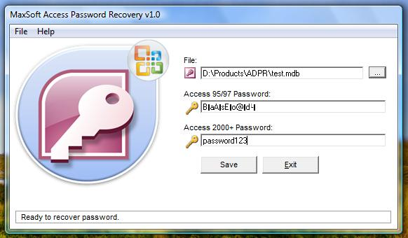



## Maxsoft Access Password Recovery

### Description

This program does recover any access database password in less than a secound it's not a bruteforce , ( Access From Office 2003 ).

We are not responsible for any illigal use of this source code , please use it for your own goods or for learning purpose.

For Additional Information Contact :

Admin@RoxDev.com
 
### More Info
 

             |
---                |---
**Submitted On**   |2008-02-11 20:14:22
**By**             |[Rashid \.W\. Haddadin](https://github.com/Planet-Source-Code/PSCIndex/blob/master/ByAuthor/rashid-w-haddadin.md)
**Level**          |Advanced
**User Rating**    |4.9 (44 globes from 9 users)
**Compatibility**  |VB 6\.0
**Category**       |[Encryption](https://github.com/Planet-Source-Code/PSCIndex/blob/master/ByCategory/encryption__1-48.md)
**World**          |[Visual Basic](https://github.com/Planet-Source-Code/PSCIndex/blob/master/ByWorld/visual-basic.md)
**Archive File**   |[Maxsoft\_Ac21703112142009\.zip](https://github.com/Planet-Source-Code/rashid-w-haddadin-maxsoft-access-password-recovery__1-72736/archive/master.zip)

